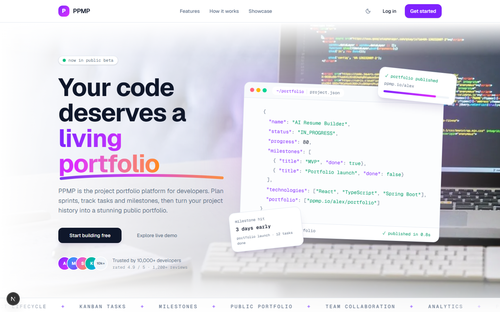
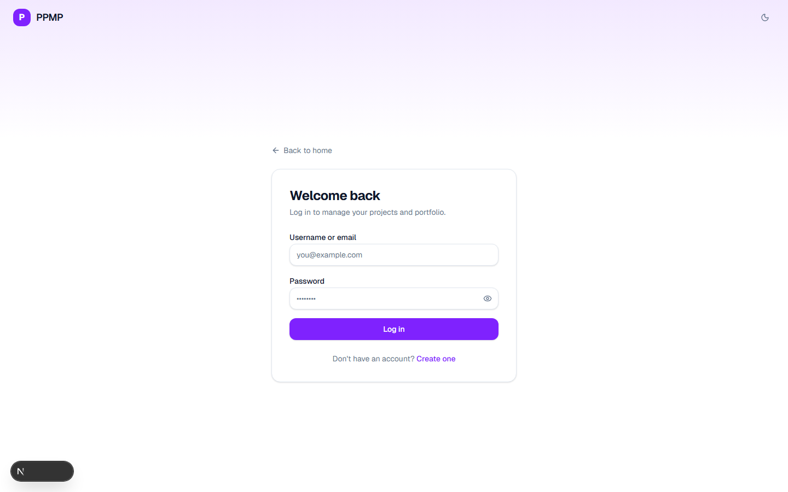
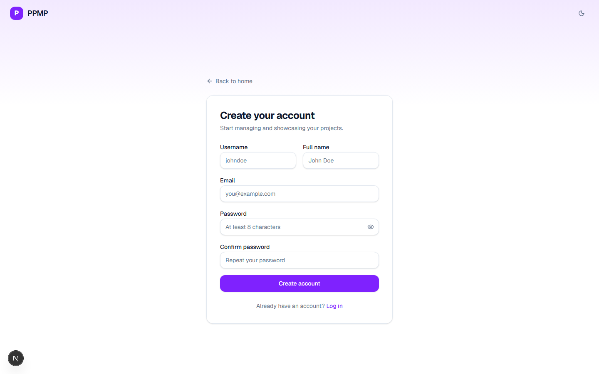

# PPMP — Project Portfolio Management Platform

Manage projects, track tasks and milestones, and turn your work into a public portfolio — all in one platform built for developers.

## Screenshots

### Home



### Login



### Register



## Structure

```
ppmp/
├── ppmp-backend/   # Spring Boot 3 REST API (Java 21, PostgreSQL, Redis, Flyway)
└── ppmp-frontend/  # Next.js 16 web app (React 19, Tailwind CSS v4, TypeScript)
```

## Run with Docker (recommended)

The whole platform (backend + PostgreSQL + Redis + frontend) runs with a single command:

```bash
cp .env.example .env   # then edit the secrets (JWT_SECRET, POSTGRES_PASSWORD)
docker compose up --build -d
```

- Frontend: http://localhost:3000
- Backend API: http://localhost:8080/api/v1
- Swagger UI: http://localhost:8080/swagger-ui.html
- Stop with: `docker compose down` (add `-v` to also delete the database data)

### Default admin account

| Username | Password     | Role        |
| -------- | ------------ | ----------- |
| `admin`  | `Admin1234!` | SUPER_ADMIN |

## Backend

- Spring Boot 3.5.3 · Java 21 · Maven
- PostgreSQL + Flyway migrations in `src/main/resources/db/migration`
- Swagger UI available at `/swagger-ui.html`

```bash
cd ppmp-backend
mvn spring-boot:run
```

Configuration via environment variables (`DB_HOST`, `DB_PORT`, `DB_NAME`, `DB_USERNAME`, `DB_PASSWORD`, `SMTP_*`, `REDIS_*`, `AWS_*`) — see `src/main/resources/application-dev.yml`.

## Frontend

- Next.js 16 · React 19 · TypeScript · Tailwind CSS v4
- API base URL defaults to `http://localhost:8080/api/v1` (override with `NEXT_PUBLIC_API_BASE_URL`)

```bash
cd ppmp-frontend
npm install
npm run dev
```

Open [http://localhost:3000](http://localhost:3000).
